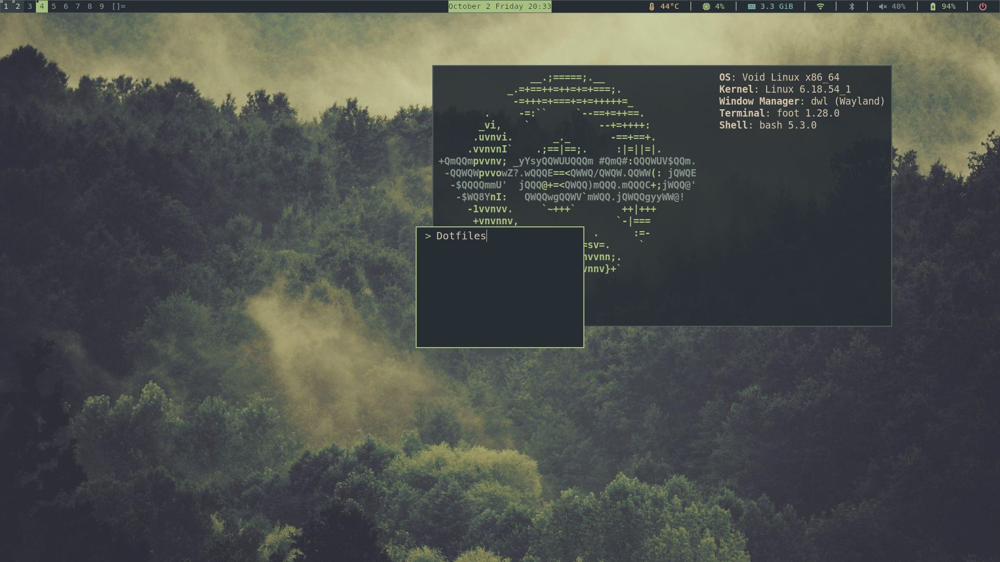

# Everforest dotfiles

My personal Everforest setup for dwl, dwlb, Foot, and Fuzzel.

## Screenshot

## Included

- Foot and Fuzzel configs.
- Bash config and tty1 session startup.
- `everbar`: status script for clock, battery, temperature, CPU, RAM,
  Wi-Fi, Bluetooth, volume, and power actions.
- `everbar-start`: bar theme, startup options, and optional wallpaper startup.
- Customized dwl files: colors, gaps, keybindings, input settings,
  build changes, and dwl IPC v2 support.
- Customized dwlb files, including a bar outline.
- Keybinding reference.
- Upstream URLs and base commits in `SOURCE-BASES.txt`.

Only selected source files are included, not complete buildable source trees.
The source files are intended for the exact upstream commits recorded in
`SOURCE-BASES.txt`.

## Assumptions

- dwl's IPC v2 changes are already present in the included `dwl.c`,
  Makefile, and protocol XML. The bar starts with `-ipc` and expects
  that compositor support.
- dwlb supports the startup options and clickable status commands used here.
- dwl is built against wlroots 0.19; XWayland is disabled in the recorded base.
- Bar appearance mainly comes from `everbar-start`, not `dwlb/config.h`.
- The keyboard layout is Norwegian.
- The clock uses `Europe/Oslo`.
- Temperature detection expects `x86_pkg_temp`.
- Brightness keys target `acpi_video0`.
- Session startup assumes tty1, D-Bus, PipeWire, and a valid `XDG_RUNTIME_DIR`.
- Python 3.9+, timezone data, Foot, Fuzzel, NetworkManager, BlueZ,
  WirePlumber, `loginctl`, and `brightnessctl` are available as needed.
- Adwaita cursors and Symbols Nerd Font Mono are installed.

## Not included

- Complete upstream source trees, compiled binaries, or generated build files.
- `lock-screen` and `shot-copy`, which are referenced by keybindings.
- Wallpaper, expected at `~/.local/share/backgrounds/wallpaper`.
- `swaybg`, used for wallpaper when available.
- Autologin service files or system-service setup.
- GTK/Qt, browser, or screen-locker themes.
- An installer.

This is a personal configuration snapshot. Some settings are hardware-specific,
and known code issues remain.

## License and credits

GPL-3.0-or-later. Original upstream licenses and attribution notices are retained.

- dwl: https://codeberg.org/dwl/dwl
- dwlb: https://github.com/kolunmi/dwlb
- Everforest: https://github.com/sainnhe/everforest
